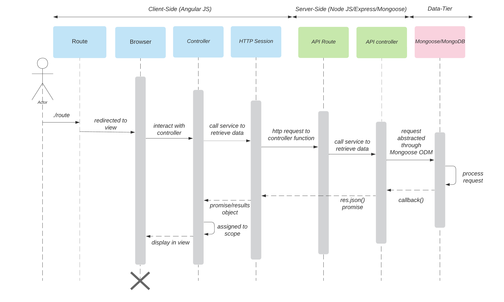
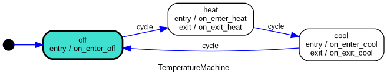
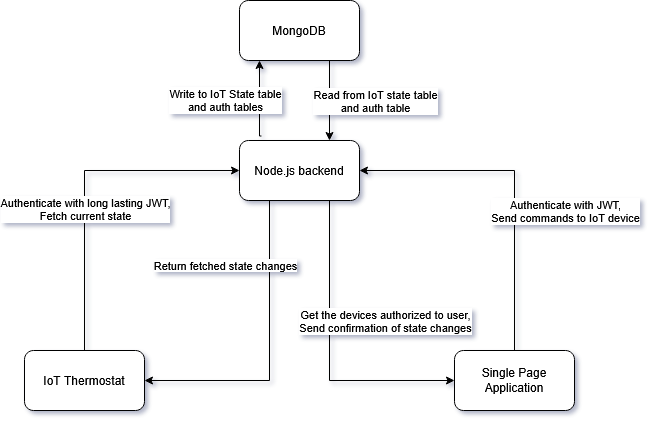
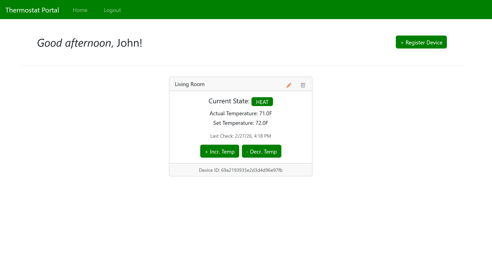

# Introduction and Narative
  Welcome to my ePortfolio and let me introduce you to the project at hand. I've built a IoT thermostat with a raspberry pi 4 and a GPIO breadboard. The device itself has a I2C temperature and humidity sensor. The device takes user input through three buttons; the first increments the temperature, the second cycles the mode from `OFF→ HEAT→ COOL→ OFF`, and finally the last button decrements the temperature. As an output to the user we have two methods. The first communicates the mode of the device, temperature, and time on a 16x2 grid display. The second output method communicates to a Node JS backend that manages a mongoDB to synchronize its session. That Node JS backend also enacts various forms of business logic for the API endpoints. These endpoints are also utilized by an Angular SPA front end. The SPA is used as a second medium of control for the IoT device where a user can view and adjust temperature and mode on as many IoT devices as registered. The SPA utilizes a bootstrap enabled minimal design to enhance the user experience. 

  I believe throughout this program at SNHU I've been able to hone many skills in computer science such as working with databases, software design, algorithms, and data structures which are demonstrated in this ePortfolio. I was also given a chance to work on my skills in professional communication both on a technical level and non-technical level for future stakeholders of all kinds. This is extremely important to me as clear communication is what builds realistic expectations for projects. Additionally, projects will continue after I've made my contributions and making clear documentation and readable code is important to longevity.

  These artifacts are justified for the SNHU capstone because it covers the three demonstration pillars which are Software Design and Engineering, Algorithms and Data Structures, and Databases. Software Design and Engineering will hit the mark because my plan is to utilize the Angular SPA from CS 465 and continue its security enhancements with JSON web tokens. This site works as one of the two points to control the IoT thermostat defined in category two of this assignment. My goal is to have this SPA poll the backend server at regular intervals for state changes of the IoT device(s). Working on the angular SPA will demonstrate an understanding of designing complex systems. Since this is a front-end system, it additionally show how I can leverage UI/UX to create a positive area for a user. The SPA allows me to single out the design, develop, and deliver professional-quality oral, written, and visual communications that are coherent, technically sound, and appropriately adapted to specific audiences and contexts. This is important in almost any technical role, but it will prove especially valuable in DevSecOps as communication between teams is vital.  

**SPA to Node** 
 

  For the Algorithms and data structures portion of the capstone assignment I’ve worked with the CS 350 final assignment artifact which is an IoT thermostat. Enhancements to the physical device will be minimal as the wired-up breakout board over the raspberry pi GPIO has been configured already. The only physical change I made is removing the serialization feature. I enhanced the project by transferring the logic from python to Java with a series of key libraries such as Pi4J and the Spring Framework components. I showcased my skills to work with complex existing projects and translate them into usable modern system by moving the underlying logic from one language to another. Additionally, I needed to rely on industry standard libraries and their documentation to develop a functional system. The AHT20 sensor for instance has minimal documentation and doesn’t possess a Java library but I reverse engineered it to work with on a java platform given their documentation found [HERE](https://cdn-learn.adafruit.com/assets/assets/000/123/394/original/Data_Sheet_AHT20.pdf?1691532479). This artifact enhancement enables me to demonstrate an ability to use well-founded and innovative techniques, skills, and tools in computing practices for the purpose of implementing computer solutions that deliver value and accomplish industry-specific goals using industry standard libraries, frameworks, and designs. 

**State Machine diagram** 
 

  Finally, I used the CS 465 final assignment for the database category. This artifact features a Node.JS backend that controls a Mongo Database. For this enhancement I worked with MongoDB which is a NoSQL structure. This plays to my advantage with its object architecture. Each entry in MongoDB is a device that contains various states and details. This information is updated as the backend is polled via the front-end SPA or the IoT device. The IoT device receives its intended temperature and Heating/Cooling state from what the Node.JS is set too. The Node.JS backend receives read and write states from both the IoT device and the SPA frontend. I demonstrated my ability to secure systems with this project. The database will contain a user table with salted hashes for validation. The System needs to be secure for both IoT devices and users to authenticate. I developed a security mindset that anticipates adversarial exploits in software architecture and designs to expose potential vulnerabilities, mitigate design flaws, and ensure privacy and enhanced security of data and resources. I hope I was able to demonstrate the skills needed to start a security, operations, and developmental overlapping career as often found in DevSecOps. This means that I’ll need to put myself in the shoes of a malicious actor to anticipate and prevent leaks, deploy web servers and databases, and demonstrate various tech stack knowledge such as spring framework. Illustrating my ability to clearly articulate and deliver professional documentation was essential for this capstone project. I hope to account for any oversights throughout the project and propose remedies in a similar way that postmortem security assessments are performed in professional settings. 

**Entire System Architecture** 
 

---

### Watch the Demo!

 

---

### Code Review Video
  This video offers a glimpse into the three artifacts chosen for this project selected from courses through Southern New Hampshire University. This code review was done **BEFORE** the final product release that is shown on the GitHub repository now. This review does encompass an analysis of code I wrote in previous courses.

**_Watch the Code Review!_** 
 

---

# Deployment Instructions

### Setting up the Node JS environment
1. Ensure that you have git installed with `git -v` if you don't you can install it [HERE](https://git-scm.com/install/).
2. Ensure that you have mongodb installed with `mongod --version`. If you don't have it installed it can be [HERE](https://www.mongodb.com/try/download/community).
3. Clone this repository with `git clone https://github.com/Cade-Bray/ePortfolio.git` or download the zip file from the latest release [HERE](https://github.com/Cade-Bray/ePortfolio/releases).
4. Create a .env file in the Node Backend file that contains your JWT secret as `JWT_SECRET=yoursecrethere` for example. This will be loaded on runtime.
5. This step various depending on your operating system. You need to open port 3000 for the node backend to communicate. On a debian based operating system you can add a firewall rule with `sudo ufw allow 3000`.
6. Navigate to the back end with `cd ePortfolio/Node_Backend`.
7. Install the dependencies from the packages.json with `npm install`.
8. Launch the application with `npm start`.

### Setting up your device
1. The first step to setting up the raspberry pi 4 device itself is wiring the GPIO. Visit [THIS](gpio) page to wire up your device accordingly.
2. Next is to load the operating system to your thermostat device. Any linux based operating system can be uitlized and I've chosen Ubuntu server 24.04.4 LTS.
3. Generate a device ID and secret using the production script in this repository. Run `python Production_Script.py` and follow the terminal instructions. You can batch generate device ID's and secrets similar to a production environment. You can find it in the releases section of the repository [HERE](https://github.com/Cade-Bray/ePortfolio/releases).
4. Load your device secret you recieved from the production script into the /etc/environment as `DEVICE_SECRET=devicesecrethere` for example.
5. Load your device ID you recieved from the production script into the /etc/environment as `DEVICE_ID=deviceidhere` for example.
6. Load your Node JS backend address in the /etc/environment as `ENDPOINT=backendpointhere` for example.
7. Install java on the device by following the Ubuntu 'Install the Java Runtime Environment' guide found [HERE](https://ubuntu.com/tutorials/install-jre#1-overview).
8. Download the .jar file from the latest release from this repository [HERE](https://github.com/Cade-Bray/ePortfolio/releases)
6. Launch the .jar file with `java -jar Thermostat.jar` and if the device is configured correctly you will see regular state output appear on the display after the spring boot framework launch information.

### Setting up the Angular environment
1. Using the same cloned repository you got earlier navigate to the ePortfolio/SPA_Frontend. If you're in the same terminal session still you can use `cd ../SPA_Frontend`.
2. Install the dependencies from the packages.json with `npm install`.
3. If your Angular server is not on the same device as your Node JS backend then navigate to 'SPA_Frontend/src/app/services/authentication.ts' and change the `baseURL` address to whatever your NodeJS setup address is currently.
4. Launch the application with `npm start`.

The Front end should appear like:

**CONGRATULATIONS!** You've now configured and deployed the thermostat IoT project. Navigate to `http://localhost:4200/` to view the angular page. Register for an account and add the device ID you configured earlier in the device /etc/environments file.
